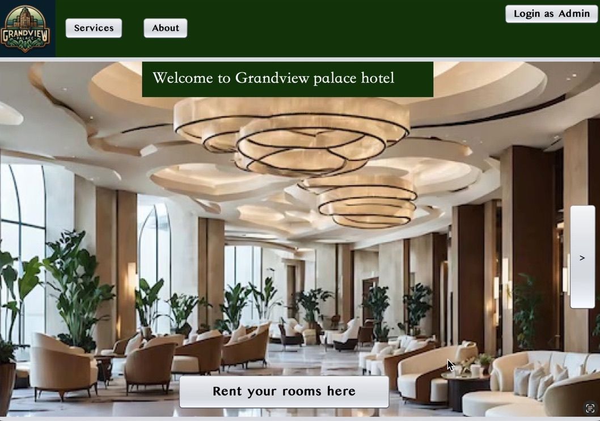

# 🏨 Projet_TP_POO2

Welcome to the **Grandview Palace Hotel** project! This is a hotel management application developed in Java with Swing. It allows you to manage rooms, clients, reservations, and much more.

## ✨ Main Features
- Room management 🛏️
- Client management 👤
- Reservations 📅
- Administrator authentication 🔐
- Modern graphical interface with Swing 🖥️

## 🗂️ Project Structure

```
POO2/src/Application/
├── ApplicationHotel.java         # Main entry point
├── model/                       # Data models (Chambre, Client, Reservation, etc.)
├── controllers/                 # Controllers (Login, Reservation, etc.)
└── views/                       # Main graphical interface
```

### 📦 Models (`model/`)
- `Hotel.java`: Central management of room, client, and reservation lists
- `Chambre.java`: Represents a hotel room, its availability, and price
- `Client.java`: Represents a client, their information, and actions
- `Reservation.java`: Manages room reservations

### 🕹️ Controllers (`controllers/`)
- `LoginButton.java`: Administrator authentication
- `RentButtonFrame.java`: Client registration and login
- `checkRoomsButton.java`: View and add rooms

### 🖼️ Views (`views/`)
- `InterfaceApplication.java`: Main application window (Swing)

## 🚀 Running the Application

1. Compile the Java project:
   ```bash
   javac -d ../bin ApplicationHotel.java model/*.java controllers/*.java views/*.java
   ```
2. Run the application:
   ```bash
   java Application.ApplicationHotel
   ```

## 👀 Screenshots





## 🎥 Video Demo

[Watch the video demo here](https://drive.google.com/file/d/1eRXpY78DySlUhs1LJYksW4Jl7lClurW3/view)

## 📝 Usage
- Administrators can log in to manage rooms and clients
- Clients can register, book, and modify their reservations
- The interface provides buttons for each main action

